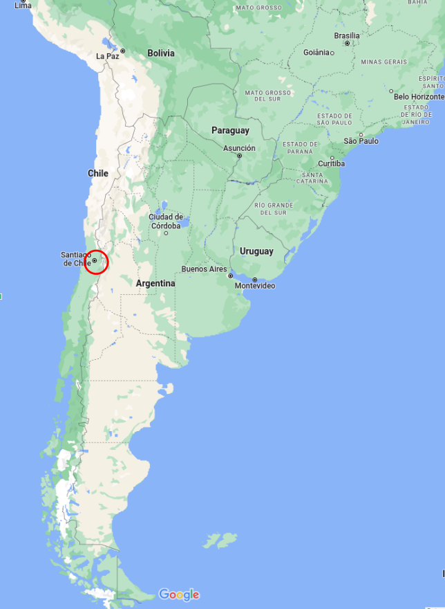
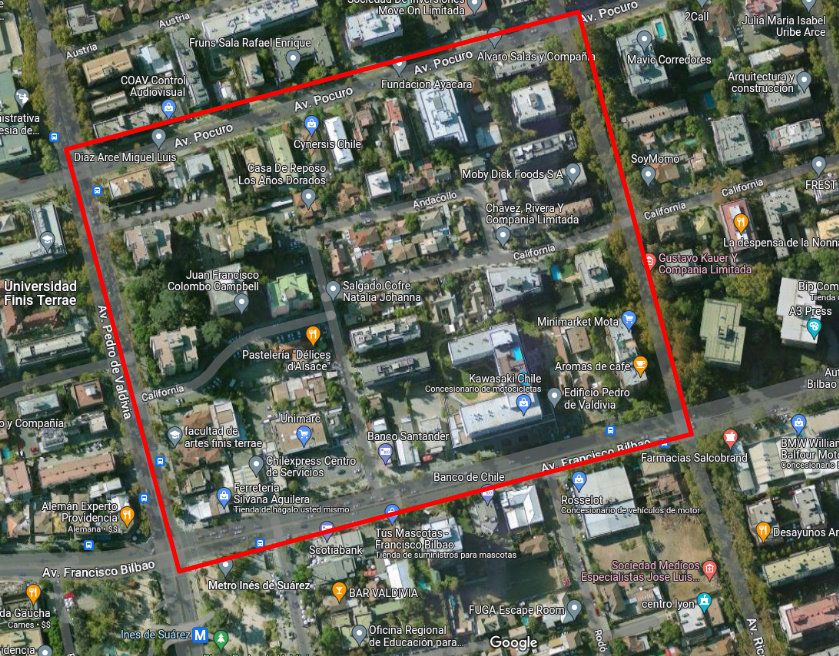
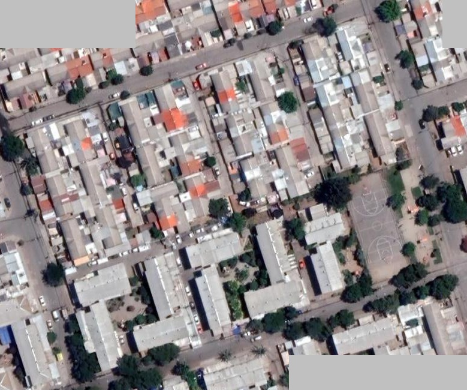
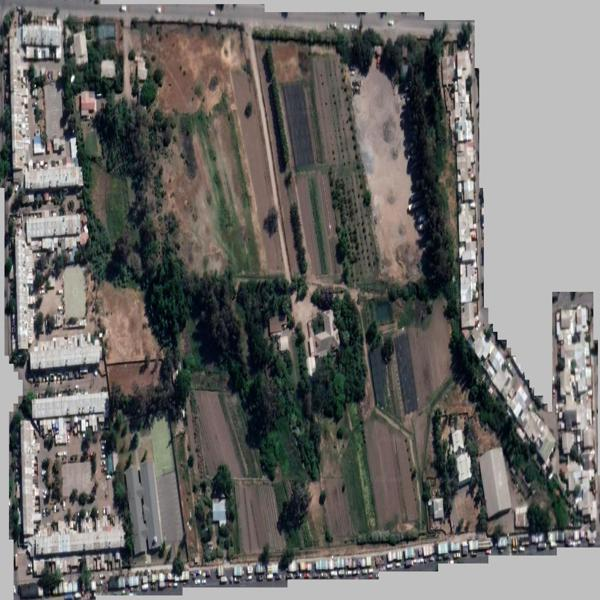
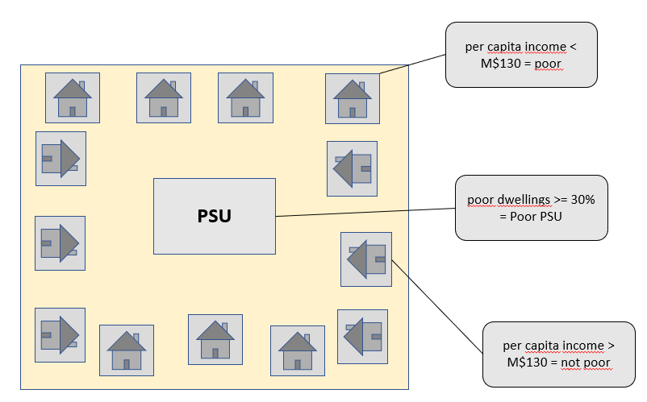

class: center, middle

.linea-superior[]
.linea-inferior[]


## Data Science Accelerator Program

### Socioeconomic stratification of the sampling frame of dwellings through the use of satellite images

#### April 4, 2023

```{r setup, include=FALSE}
options(htmltools.dir.version = TRUE)
knitr::opts_chunk$set(message = FALSE) 
```

```{r xaringan-themer, include=FALSE, warning=FALSE}
library(xaringanthemer)
```

---

background-image: url("imagenes/fondo2.PNG")
background-size: contain;
background-position: 100% 0%

# Aims

**Stratify** selected portions of the dwelling sampling frame in the **Metropolitan Region**, identifying PSU of **high, medium and low** stratum, using satellite images and  **visual recognition**.

--

.center[]


---

background-image: url("imagenes/fondo2.PNG")
background-size: contain;
background-position: 100% 0%

# Aims

.center[]


---

background-image: url("imagenes/fondo2.PNG")
background-size: contain;
background-position: 100% 0%

# Context


- What is a **sampling frame**?

    - It is a list where it is possible to identify all the units
    - We will work with the dwellings sampling frame

--

- How often is the sampling Frame updated?

    - After each Population and Housing Census (~10 years)
    - Stratification takes about 2 more years

--
  
- What is stratification and what is it for?

    - It is the clustering of the PSU according to homogeneous socioeconomic groups
    - In sociology and economics it is a proxy for material well-being
    - Increases the efficiency of survey samples (lower cost)
    - Improves the accuracy of estimates from surveys
    - Improves the targeting of public policy


---

background-image: url("imagenes/fondo2.PNG")
background-size: contain;
background-position: 100% 0%

# Problem and aims

--

- This work seeks to stratify the sampling frame at the PSU level

--

- What is the problem currently?

    - The Censuses do not ask for income due to its difficulty of capture
    - It has been stratified with variables that are considered a *proxy* of well-being
        - Percentage of people in higher education at the PSU
        - Occupancy rate at the PSU
        -	Percentage of homes with a high materiality index in the PSU
        -	Total children born

--

- in summary:

    - The methodology is **slow to update**
    - The variables available for the procedure are **inadequate**
    - The methodology is questioned: **non-structural variables**


---

background-image: url("imagenes/fondo2.PNG")
background-size: contain;
background-position: 100% 0%

# Description of data

- The training set is made up of satellite image clippings that each represent a PSU.

--

- Information for labeling is available from 3 surveys.

--

- Total of **1843 images** for training.

--

- Some example images:

--

low stratum PSU:

.center[]

---

background-image: url("imagenes/fondo2.PNG")
background-size: contain;
background-position: 100% 0%

# Description of data

low stratum PSU:

.center[]

---

background-image: url("imagenes/fondo2.PNG")
background-size: contain;
background-position: 100% 0%

# Description of data

High stratum PSU:

.center[]

---

background-image: url("imagenes/fondo2.PNG")
background-size: contain;
background-position: 100% 0%

# Description of data

High stratum PSU:

.center[]


---

background-image: url("imagenes/fondo2.PNG")
background-size: contain;
background-position: 100% 0%

# Labels

PSU Labelling:

.center[]


---

background-image: url("imagenes/fondo2.PNG")
background-size: contain;
background-position: 100% 0%

# Progress status

--

1. Obtaining income data to create the labels for PSUs ✔️

--

2. Obtaining polygons associated to PSUs ✔️

--

3. PSU cropping using *software* SAS Planet ✔️

--

4. PSU labelling &#9997;

--

5. Development of a binary classifier prototype (low stratum / other) ✔️

--

6. Development of multiclass classifier (high, medium, low) &#10060;

--

7. Evaluation of the classifier &#9997;

--

8. Validation with expert judgment &#10060;

--

9. Final adjustments to the model and/or training data &#10060;

--

10. Proposal for production &#10060;

--

11. Writing of the methodological document &#9997;


---

background-image: url("imagenes/fondo2.PNG")
background-size: contain;
background-position: 100% 0%

# Main challenges

--

- Automate polygon cropping.

--

- We are currently training with 211 images (~20% low stratum). It remains to label the rest of the images with survey information.

--

- The **labelling is not trivial**. It implies a deep knowledge of income measurement in surveys.

--

- Our classifier obtains an 80% accuracy, **predicting the absence of the attribute in all cases**.

--

- An alternative is **the integration of known external information** to the images, such as the district.

--

- **The amount of data available is limited**, unless another approach is taken, such as predicting the stratum of each building within a PSU.

    - We are exploring this approach with our mentor.

--

- The images are **complex** and very **heterogeneous**.

---


class: center, middle

.linea-superior[]
.linea-inferior[]


## Presentation DS Accelerator Program

### Socioeconomic stratification of the sampling frame of dwellings through the use of satellite images

#### April 4, 2023